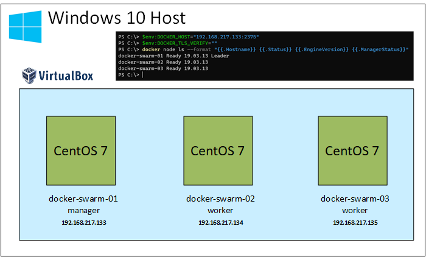

Vagrant Docker Swarm
====================

Although [Kubernetes](https://kubernetes.io/) has become the _de facto standard_ for container orchestration we still find environments that use [Docker Swarm mode](https://docs.docker.com/engine/swarm/).  This repo provides the configuration to spin up a Docker Swarm mode cluster using [Vagrant](https://www.vagrantup.com/).

### Testing environment

The configuration in this repository is designed and tested to run on a Windows 10 system (tested on an Intel i7 laptop with 8GB RAM) using [Vagrant](https://www.vagrantup.com/), [Docker Toolbox](https://github.com/docker/toolbox) and [VirtualBox](https://www.virtualbox.org/).  

_Note_: [Docker Desktop](https://www.docker.com/products/docker-desktop) is now the preferred method to install Docker support on WIndows 10 so it should work with that too but for my requirements, in this particular example, I needed to work with the older Docker Toolbox.

Tested versions of products (may work with different versions):

* Windows 10 20H2
* Docker Toolbox [19.03.1](https://github.com/docker/toolbox/releases/download/v19.03.1/DockerToolbox-19.03.1.exe)
* VirtualBox [6.1.16](https://download.virtualbox.org/virtualbox/6.1.16/VirtualBox-6.1.16-140961-Win.exe) (updated after installing Docker Toolbox)
* Vagrant - Windows 64-bit [2.2.13](https://releases.hashicorp.com/vagrant/2.2.13/vagrant_2.2.13_x86_64.msi)
* Git for Windows 64-bit [2.29.2](https://github.com/git-for-windows/git/releases/download/v2.29.2.windows.2/Git-2.29.2.2-64-bit.exe)

### Architecture layout


In the above diagram we can see that after deployment we will have a Docker Swarm mode 3-node cluster with a single manager and 2 x worker nodes.  The design is as simple as possible to demonstrate some higher level concepts of working with Swarm and purposely avoids production level aspects such as TLS certificates and high availability.  All that we want for our purposes is a simple 3-node cluster.

### Spinning up the environment

The following steps will bring up the Docker swarm mode cluster once you have installed all of the products detailed in the [Testing environment](#testing-environment) section.  Depending on the speed of your system and Internet connection the environment should hopefully be up and running in around an hour or so.

````powershell

mkdir \vagrant
cd \vagrant
git clone https://github.com/tonyskidmore/docker-swarm.git
cd docker-swarm
vagrant up

````

### Accessing the environment from the Windows host

Now that the environment has been deployed the Docker Swarm mode can be accessed from the Windows host system.  Run Windows PowerShell and enter the following commands:

````powershell
$env:DOCKER_HOST="192.168.217.133:2375"
$env:DOCKER_TLS_VERIFY=""
docker node ls
````
_Note:_ The `DOCKER_HOST` and `DOCKER_TLS_VERIFY` environment variable commands will need to be set on each new PowerShell session that is opened.  These commands tell the `docker` command to connect to our manager node and not to use TLS.

Example expected output:

````powershell

ID                            HOSTNAME            STATUS              AVAILABILITY        MANAGER STATUS      ENGINE VERSION
ty3mfoy14ldrpj4q5vsf5rpjp *   docker-swarm-01     Ready               Active              Leader              19.03.13
lrqp5wvpf978iq94du4ccr83i     docker-swarm-02     Ready               Active                                  19.03.13
qwcz1i9xg5v3f9cav9ba39zvf     docker-swarm-03     Ready               Active                                  19.03.13

````

Should you wish to SSH into any of the Docker Swarm mode nodes you can use the `vagrant ssh <nodename>` command.  For example, to SSH into our manager node:

````powershell
cd \vagrant\docker-swarm
vagrant ssh docker-swarm-01
[vagrant@docker-swarm-01 ~]$
````

### Stopping and starting the environment

When the test cluster is not being actively used, the nodes can be suspended and resumed at will.  This can be done by moving to the location of the vagrant file and issuing the `suspend` and `resume` commands:

````powershell
cd \vagrant\docker-swarm

# suspend our docker swarm nodes
vagrant suspend

# resume our docker swarm nodes
vagrant resume

````

Alternatively the VMs can be stopped and started:

````powershell
cd \vagrant\docker-swarm

# shutdown our docker swarm nodes
vagrant halt

# start up docker swarm nodes
vagrant up

````

### Destroying the environment

Once testing has been completed the Docker swarm mode cluster can be destroyed by running the following commands:

````powershell

cd \vagrant\docker-swarm
vagrant destroy -force

````

### Learning material

[Swarm mode overview](https://docs.docker.com/engine/swarm/)  
[Getting Started with Docker Swarm Mode](https://www.pluralsight.com/courses/docker-swarm-mode-getting-started) by Wes Higbee

